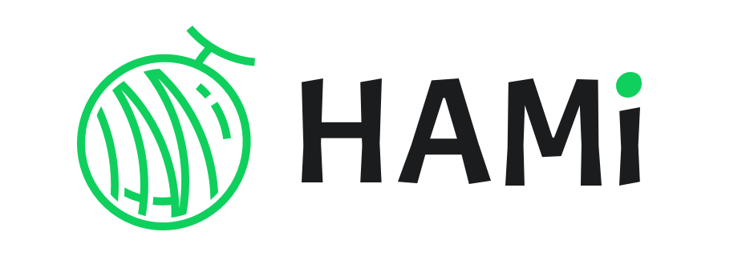

English version | [中文版](README_cn.md) | [日本語版](README_ja.md)



[](/LICENSE)
[](https://github.com/Project-HAMi/HAMi/actions/workflows/ci.yaml)
[](https://github.com/Project-HAMi/HAMi/releases/latest)
[](https://www.bestpractices.dev/en/projects/9416)
[](https://goreportcard.com/report/github.com/Project-HAMi/HAMi)
[](https://codecov.io/gh/Project-HAMi/HAMi)
[](https://app.fossa.com/projects/git%2Bgithub.com%2FProject-HAMi%2FHAMi?ref=badge_shield)
[](https://hub.docker.com/r/projecthami/hami)
[](https://cloud-native.slack.com/archives/C07T10BU4R2)
[](https://discord.gg/Amhy7XmbNq)
[](https://project-hami.io)

# HAMi

**Kubernetes GPU virtualization and heterogeneous accelerator scheduling for AI infrastructure.**


HAMi stands for **Heterogeneous AI Computing Virtualization Middleware**. Formerly known as `k8s-vGPU-scheduler`, HAMi helps platform teams share expensive GPUs and other AI accelerators across Kubernetes workloads, isolate device memory and compute, and schedule pods with device-aware policies without changing application code.

HAMi is a [CNCF Sandbox](https://www.cncf.io/sandbox-projects/) and [CNCF Landscape](https://landscape.cncf.io/?item=orchestration-management--scheduling-orchestration--hami) project. It is also listed in the [CNAI Landscape](https://landscape.cncf.io/?group=cnai&item=cnai--general-orchestration--hami).


## Why HAMi?

AI infrastructure teams often run into the same Kubernetes accelerator problems: whole GPUs are allocated to small jobs, teams compete for scarce devices, different accelerator vendors expose different operational models, and schedulers lack enough device context to place workloads efficiently.

HAMi provides a Kubernetes-native layer for:

- **Device sharing**: allocate a fraction of a physical accelerator by memory, core, or device count.
- **Resource isolation**: enforce per-workload accelerator memory and compute limits where the device backend supports it.
- **Device-aware scheduling**: place pods with topology-aware, binpack, spread, and device-specific scheduling policies.
- **Heterogeneous AI clusters**: manage NVIDIA GPUs, NPUs, DCUs, MLUs, and other accelerator types through one scheduling and allocation workflow.
- **Zero application changes**: keep using standard Kubernetes resource requests and limits.
- **Production operations**: expose metrics, dashboards, WebUI, Helm installation, and community-supported deployment guidance.

## Use Cases

- Increase GPU utilization in shared Kubernetes AI clusters.
- Run multi-tenant notebook, training, and inference workloads on the same accelerator pool.
- Build private cloud AI platforms with fair device allocation and quota control.
- Operate heterogeneous accelerator clusters across NVIDIA, Ascend, Cambricon, Hygon, Iluvatar, MetaX, Moore Threads, and other vendors.
- Combine HAMi with Kubernetes schedulers such as kube-scheduler and Volcano for batch AI workloads.

## How It Works

HAMi is composed of a mutating webhook, scheduler extender, device plugins, and device-specific in-container virtualization components.

```text
Pod submission
  -> HAMi mutating webhook
  -> HAMi scheduler filter / score / bind
  -> device allocation written to pod annotations
  -> device plugin Allocate()
  -> container runtime environment
  -> HAMi monitor and metrics
```

## Device Virtualization

HAMi lets workloads request only the accelerator resources they need. For example, the following pod asks for one physical NVIDIA GPU with 3 GiB of GPU memory:

```yaml
resources:
  limits:
    nvidia.com/gpu: 1
    nvidia.com/gpumem: 3000
```

The workload sees the allocated device resources inside the container, while HAMi coordinates scheduling, allocation, and isolation.


> Notes:
>
> 1. After installing HAMi, the value of `nvidia.com/gpu` registered on the node defaults to the number of vGPUs.
> 2. When requesting resources in a pod, `nvidia.com/gpu` refers to the number of physical GPUs required by the current pod.

## Supported Devices

HAMi supports multiple heterogeneous accelerator backends, including GPUs, NPUs, DCUs, MLUs, GCUs, XPUs, and more. Device capabilities vary by vendor, model, driver, and hardware generation.

See the current [HAMi supported devices](https://project-hami.io/docs/userguide/device-supported) page for the maintained support matrix.

## Quick Start

### Prerequisites

For the NVIDIA device plugin path, prepare:

- NVIDIA driver >= 440
- `nvidia-docker` version > 2.0
- NVIDIA configured as the default runtime for containerd, Docker, or CRI-O
- Kubernetes >= 1.23
- glibc >= 2.17 and < 2.30
- Linux kernel >= 3.10
- Helm > 3.0

### Install With Helm

Label GPU nodes so HAMi can manage them:

```bash
kubectl label nodes <node-name> gpu=on
```

Add the HAMi Helm repository:

```bash
helm repo add hami-charts https://project-hami.github.io/HAMi/
helm repo update
```

Install HAMi:

```bash
helm install hami hami-charts/hami -n kube-system
```

Verify that the scheduler and device plugin are running:

```bash
kubectl get pods -n kube-system
```

When `hami-device-plugin` and `hami-scheduler` are both `Running`, submit an example workload:

```bash
kubectl apply -f examples/nvidia/default_use.yaml
```

For the complete installation guide and configuration options, see the [HAMi documentation](https://project-hami.io/docs/get-started/deploy-with-helm/).

## Scheduling Policies

HAMi supports multiple scheduling modes for AI workloads:

- **binpack**: pack workloads onto fewer nodes or devices to improve consolidation.
- **spread**: distribute workloads across nodes or devices to reduce contention.
- **topology-aware scheduling**: choose device combinations based on GPU topology when supported.
- **dynamic MIG**: create and allocate NVIDIA MIG instances dynamically for supported cards and modes.

HAMi works with the default Kubernetes scheduler path and can also be used with Volcano for batch-oriented AI workloads. See the [HAMi website](https://project-hami.io/docs/) for current scheduler integration guides.

## Observability And WebUI

HAMi exposes metrics for monitoring cluster accelerator usage. After installation, metrics are available through the scheduler monitor endpoint:

```text
http://<scheduler-ip>:<monitor-port>/metrics
```

The default monitor port is `31993`. You can change it with Helm values such as `--set scheduler.service.monitorPort=<port>`.

HAMi also provides:

- [HAMi-WebUI](https://github.com/Project-HAMi/HAMi-WebUI) for visual cluster and device management.
- Grafana dashboard examples for accelerator monitoring.
- Benchmark material for evaluating workload behavior and scheduling effects.


## Roadmap, Governance, And Contributing

HAMi is governed by [maintainers](./MAINTAINERS.md) and [contributors](./AUTHORS.md). Governance is described in the [HAMi community repository](https://github.com/Project-HAMi/community/blob/main/governance.md).

To contribute code, documentation, tests, or device backend improvements, read [CONTRIBUTING.md](./CONTRIBUTING.md).

## Community

The HAMi community is open to users, contributors, hardware vendors, and platform teams building Kubernetes-based AI infrastructure.

- Website: [project-hami.io](https://project-hami.io)
- Discord: [Join the HAMi Discord](https://discord.gg/Amhy7XmbNq) (recommended)
- Slack: [#hami-dev on CNCF Slack](https://cloud-native.slack.com/archives/C07T10BU4R2)
- Mailing list: [hami-project](https://groups.google.com/forum/#!forum/hami-project)
- [Meeting notes and agenda](https://docs.google.com/document/d/1YC6hco03_oXbF9IOUPJ29VWEddmITIKIfSmBX8JtGBw/edit#heading=h.g61sgp7w0d0c)
- Chinese community meeting: Friday 16:00 UTC+8, weekly — [Meeting link](https://meeting.tencent.com/dm/Ntiwq1BICD1P)
- English community meeting: Wednesday 16:00 UTC+8, biweekly — [Meeting link](https://zoom-lfx.platform.linuxfoundation.org/meeting/95994137931?password=55b961b5-3e8e-4040-8657-0f2d26511f1d)

## Talks And References

| Event | Talk |
| --- | --- |
| CHINA CLOUD COMPUTING INFRASTRUCTURE DEVELOPER CONFERENCE, Beijing 2024 | [Unlocking heterogeneous AI infrastructure on k8s clusters](https://live.csdn.net/room/csdnnews/3zwDP09S) |
| KubeDay Japan 2024 | [Unlocking Heterogeneous AI Infrastructure K8s Cluster: Leveraging the Power of HAMi](https://www.youtube.com/watch?v=owoaSb4nZwg) |
| KubeCon + AI_dev Open Source GenAI & ML Summit China 2024 | [Is Your GPU Really Working Efficiently in the Data Center? N Ways to Improve GPU Usage](https://www.youtube.com/watch?v=ApkyK3zLF5Q) |
| KubeCon + AI_dev Open Source GenAI & ML Summit China 2024 | [Unlocking Heterogeneous AI Infrastructure K8s Cluster](https://www.youtube.com/watch?v=kcGXnp_QShs) |
| KubeCon Europe 2024 | [Cloud Native Batch Computing with Volcano: Updates and Future](https://youtu.be/fVYKk6xSOsw) |

## License

HAMi is licensed under the Apache License 2.0. See [LICENSE](LICENSE) for details.

Copyright Contributors to HAMi, established as HAMi a Series of LF Projects, LLC.
